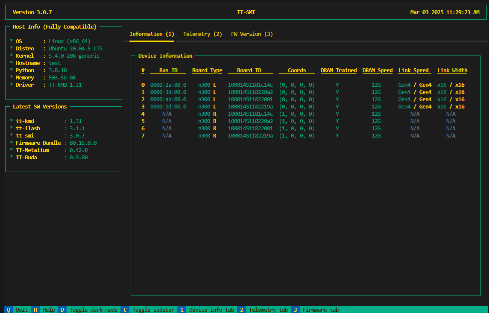
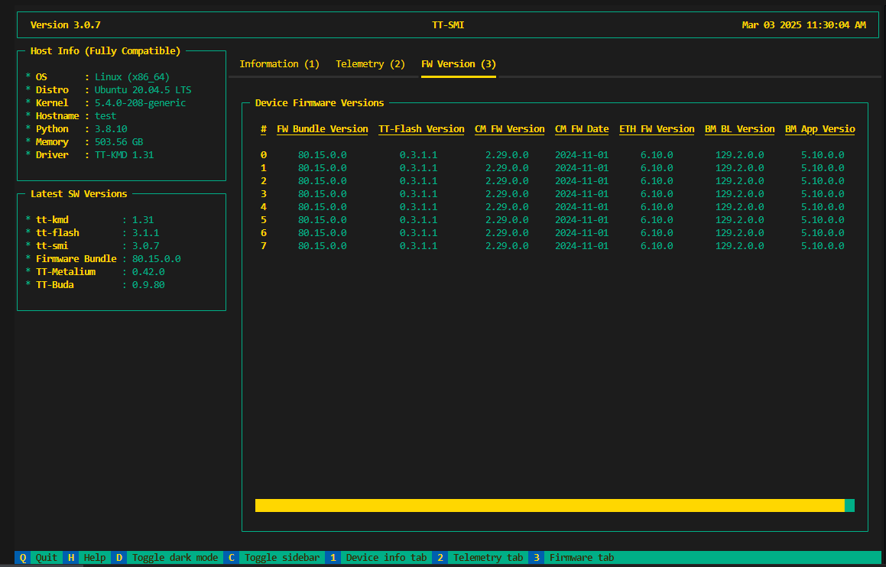
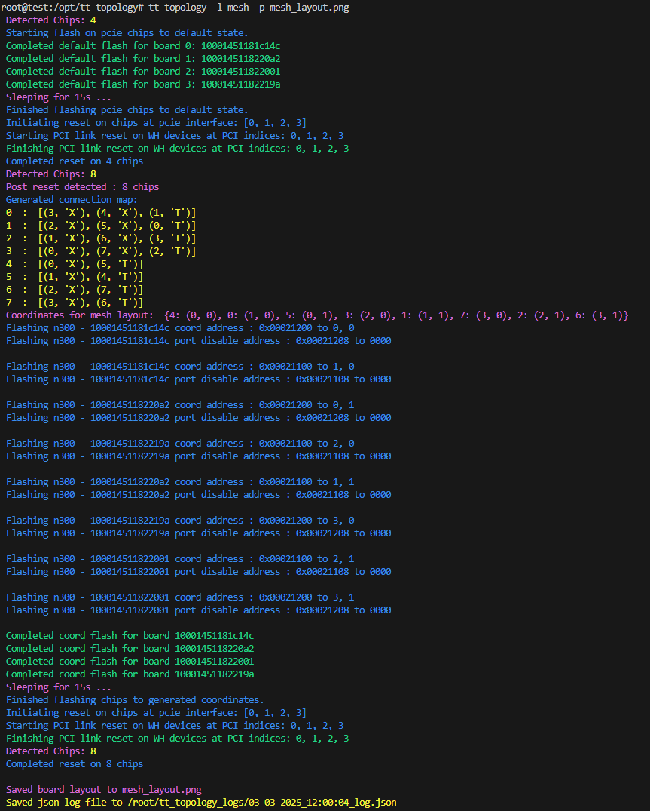
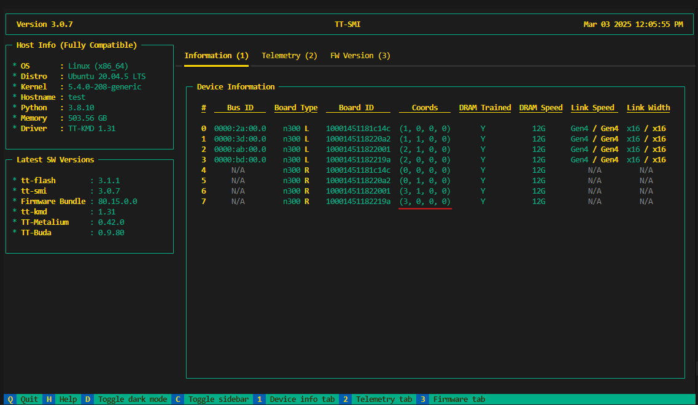

# Tenstorrent NPU Setup Guide: Install Drivers & SDK


## 1. Prerequisites
Grayskull is no longer supported by Tenstorrent. If you are still using Grayskull, you will need to rely on the last available software versions or consider upgrading to a newer Tenstorrent NPU.

The last supported versions of Tenstorrent’s software for Grayskull are:

- **TT-Firmware:** `fw_pack-80.14.0.0.fwbundle`
- **TT-KMD:** `ttkmd_1.31`
- **TT-Buda:** `v0.19.3`
- **TT-Metalium:** `v0.55`


Note the current compatibility matrix: 

| Device               | OS              | Python   | Driver (TT-KMD)    | Firmware (TT-Flash)                        | TT-SMI                | TT-Topology                    |
|----------------------|-----------------|----------|--------------------|--------------------------------------------|-----------------------|--------------------------------|
| Galaxy (Wormhole 4U) | Ubuntu 22.04    | 3.10     | 1.33 or above      | fw_pack-80.10.1.0                          | v2.2.3 or lower       | v1.1.3 or above, `mesh` config |
| Galaxy (Wormhole 6U) | Ubuntu 22.04    | 3.10     | 1.33 or above      | fw_pack-80.17.0.0 (v80.17.0.0)             | v3.0.12 or above      | N/A                            |
| Wormhole             | Ubuntu 22.04    | 3.10     | v1.33 or above     | fw_pack-80.17.0.0 (v80.17.0.0)             | v3.0.12 or above      | N/A                            |
| T3000 (Wormhole)     | Ubuntu 22.04    | 3.10     | v1.33 or above     | fw_pack-80.17.0.0 (v80.17.0.0)             | v3.0.12 or above      | v1.2.5 or above, `mesh` config |
| Blackhole            | Ubuntu 22.04    | 3.10     | v1.33 or above     | fw_pack-80.18.0.0 (v80.18.0.0)             | v3.0.12 or above       | N/A                            |


<br />
## 2.  Install [TT-KMD](https://github.com/tenstorrent/tt-kmd) for Tenstorrent Wormhole N300S
Installing the Kernel-Mode Driver (TT-KMD) is an essential step for setting up the
**Tenstorrent Wormhole N300S** system correctly.

 Install Software Dependencies

 ```bash title="bash"
 sudo apt update && sudo apt install -y wget git python3-pip dkms cargo python-is-python3
 ```
<br />
 Install the driver (TT-KMD) by running these commands in the terminal:

 ```bash  title="bash"
git clone https://github.com/tenstorrent/tt-kmd.git
cd tt-kmd
sudo dkms add .
sudo dkms install "tenstorrent/$(./tools/current-version)"
sudo modprobe tenstorrent

## To uninstall ex.. 1.31:./tools/current-version
sudo modprobe -r tenstorrent
sudo dkms remove tenstorrent/$(current-version) --all

## Driver Module
root@test:/# lsmod |grep -i tens
tenstorrent            49152  0
 ```

<br />
## 3. Update Device [TT-Firmware](https://github.com/tenstorrent/tt-flash) with [TT-Flash](https://github.com/tenstorrent/tt-firmware)
The TT-Firmware file needs to be installed using the TT-Flash utility.
Firmware updates are required only once when the card is first unboxed or when updating to a new firmware version.

To Build from git (development):

```bash title="bash"
## Building the repository
sudo apt install cargo
curl --proto '=https' --tlsv1.2 -sSf https://sh.rustup.rs | sh
source "$HOME/.cargo/env"

git clone https://github.com/tenstorrent/tt-flash.git
cd tt-flash

## (Optional) Virtual environment ##
python -m venv venv
source venv/bin/activate
####################################

pip install --upgrade pip
pip3 install .

root@test:/opt# tt-flash -h
usage: tt-flash [-h] [-v] [--sys-config SYS_CONFIG] [--no-color] [--no-tty] {flash,verify} ...

Version: 3.1.1

optional arguments:
  -h, --help            show this help message and exit
  -v, --version         show program's version number and exit
  --sys-config SYS_CONFIG
                        Path to the pre generated sys-config json
  --no-color            Disable the colorful output
  --no-tty              Force disable the tty command output

command:
  {flash,verify}
    verify              Verify the contents of the SPI. Will display the currently running and flashed bundle version of the fw and checksum the fw against either what was flashed previously according the the file system state, or a
                        given fw bundle. In the case where a fw bundle or flash record are not provided the program will search known locations that the flash record may have been written to and exit with an error if it cannot be found
                        or read.
```                        

<br />
Download TT-Firmware and Update:

```bash title="bash"
git clone https://github.com/tenstorrent/tt-firmware.git
cd tt-firmware/
root@test:/opt/tt-firmware# ls
experiments  fw_pack-80.15.0.0.fwbundle  latest.fwbundle  LICENSE  LICENSE_understanding.txt  README.md  SUMMARY.md

## Since four cards are installed in this system, all four are shown in the update process.
## However, the output will vary depending on the actual number of installed cards.

root@test:/opt/tt-firmware# tt-flash --fw-tar fw_pack-80.15.0.0.fwbundle --force
Stage: SETUP
        Searching for default sys-config path
        Checking /etc/tenstorrent/config.json: not found
        Checking ~/.config/tenstorrent/config.json: not found

        Could not find config in default search locations, if you need it, either pass it in explicitly or generate one
        Warning: continuing without sys-config, galaxy systems will not be reset
Stage: DETECT
Stage: FLASH
        Sub Stage: VERIFY
                Verifying fw-package can be flashed: complete
                Verifying Wormhole[0] can be flashed
                Verifying Wormhole[1] can be flashed
                Verifying Wormhole[2] can be flashed
                Verifying Wormhole[3] can be flashed
        Stage: FLASH
                Sub Stage FLASH Step 1: Wormhole[0]
                        ROM version is: (80, 14, 0, 0). tt-flash version is: (80, 15, 0, 0)
                        Forced ROM update requested. ROM will now be updated.
                        Board will require reset to complete update, checking if an automatic reset is possible
                                Success: Board can be auto reset; will be triggered if the flash is successful
                Sub Stage FLASH Step 1: Wormhole[1]
                        ROM version is: (80, 14, 0, 0). tt-flash version is: (80, 15, 0, 0)
                        Forced ROM update requested. ROM will now be updated.
                        Board will require reset to complete update, checking if an automatic reset is possible
                                Success: Board can be auto reset; will be triggered if the flash is successful
                Sub Stage FLASH Step 1: Wormhole[2]
                        ROM version is: (80, 14, 0, 0). tt-flash version is: (80, 15, 0, 0)
                        Forced ROM update requested. ROM will now be updated.
                        Board will require reset to complete update, checking if an automatic reset is possible
                                Success: Board can be auto reset; will be triggered if the flash is successful
                Sub Stage FLASH Step 1: Wormhole[3]
                        ROM version is: (80, 14, 0, 0). tt-flash version is: (80, 15, 0, 0)
                        Forced ROM update requested. ROM will now be updated.
                        Board will require reset to complete update, checking if an automatic reset is possible
                                Success: Board can be auto reset; will be triggered if the flash is successful
                Sub Stage FLASH Step 2: Wormhole[0] {n300}
                        Writing new firmware... SUCCESS
                        Firmware verification... SUCCESS
                        Initiating local to remote data copy
                Sub Stage FLASH Step 2: Wormhole[1] {n300}
                        Writing new firmware... SUCCESS
                        Firmware verification... SUCCESS
                        Initiating local to remote data copy
                Sub Stage FLASH Step 2: Wormhole[2] {n300}
                        Writing new firmware... SUCCESS
                        Firmware verification... SUCCESS
                        Initiating local to remote data copy
                Sub Stage FLASH Step 2: Wormhole[3] {n300}
                        Writing new firmware... SUCCESS
                        Firmware verification... SUCCESS
                        Initiating local to remote data copy
                Flash and verification for all chips completed, will now wait for n300 remote copy to complete...
                Remote copy completed
Stage: RESET
 Starting PCI link reset on WH devices at PCI indices: 0, 1, 2, 3
 Finishing PCI link reset on WH devices at PCI indices: 0, 1, 2, 3
FLASH SUCCESS
```

<br />
## 4. Set Up HugePages
HugePages lets your system allocate dedicated memory to accelerate communication with Tenstorrent devices. Set up HugePages by running these commands in the terminal:

```bash title="bash"
# Install `.deb`
wget https://github.com/tenstorrent/tt-system-tools/releases/download/upstream%2F1.1/tenstorrent-tools_1.1-5_all.deb
sudo dpkg -i tenstorrent-tools_1.1-5_all.deb

# Start Services
sudo systemctl enable --now tenstorrent-hugepages.service
sudo systemctl enable --now 'dev-hugepages\x2d1G.mount'

# System Reboot
sudo reboot
```

<br />

## 5. Install the System Management Interface [TT-SMI](https://github.com/tenstorrent/tt-smi)
Install Tenstorrent Software Management Interface [TT-SMI](https://github.com/tenstorrent/tt-smi):


To Build from git (development):

```bash title="bash"
# Clone the repository
git clone https://github.com/tenstorrent/tt-smi.git
cd tt-smi/

# Create and activate a virtual environment
python3 -m venv .venv
source .venv/bin/activate

# Upgrade pip
pip3 install --upgrade pip

# Install protobuf (required for Ubuntu 22.04)
sudo apt install -y protobuf-compiler

# Install tt-smi
pip3 install .

# Usage: Command line arguments
tt-smi [-h] [-l] [-v] [-s] [-ls] [-f [filename]] [-g] [-r 0,1 ... or config.json]

# Run the TT-SMI utility
tt-smi
```

<br />
A display with device information, telemetry, and firmware will appear:



<br />
You can check the results of the firmware update to 80.15.0.0 applied previously.


<br />

## 6. Optional : Multi-Card Configuration [TT-Topology](https://github.com/tenstorrent/tt-topology)
If you have installed a multi-card Wormhole system (4 cards), install the Tenstorrent Topology utility and configure a mesh topology by running the following commands in the terminal.
TT-Topology is a command line utility used to flash multiple NB cards on a system to use specific eth routing configurations.

In this guide, we will walk you through the setup process for your Tenstorrent NPU, including hardware installation, driver setup, and SDK configuration.

:::note
Currently, the Tenstorrent Demo is designed for either a single-card or a 4-card setup. If you are using a multi-card (4 cards) configuration, you must configure the topology to run the demo properly.
:::
<br />
For other configurations or detailed explanations, please refer to [this](https://github.com/tenstorrent/tt-topology).

<br />

```bash title="bash"
git clone https://github.com/tenstorrent/tt-topology.git
cd tt-topology
pip3 install --upgrade pip
pip3 install .
tt-topology -l mesh -p mesh_layout.png
```

<br />



<br />

You can see the configuration as shown in the image below.
After completing the setup, you can check that the Coords values have changed by running tt-smi.

