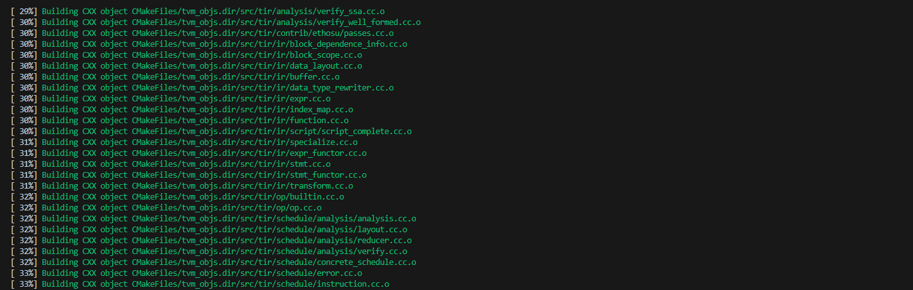
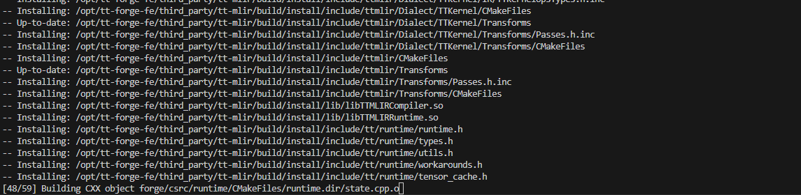
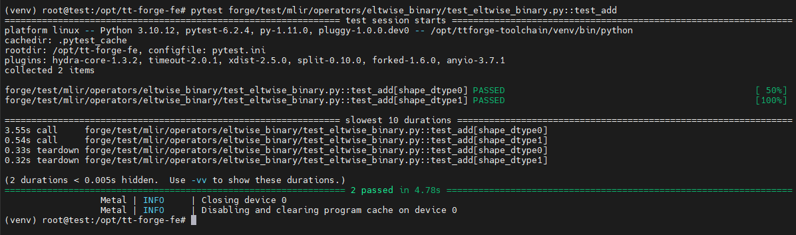

import Tabs from '@theme/Tabs';
import TabItem from '@theme/TabItem';
import { useState } from 'react';

# Tenstorrent SDK Installation TT-Forge-Fe

<br />

This guide will walk you through the installation process for TT-Forge-Fe, Tenstorrent's frontend compiler for the Forge SDK. TT-Forge-Fe enables you to compile models from various frameworks to run efficiently on Tenstorrent NPU hardware.

TT-Forge-Fe is a key component of the Tenstorrent software stack that:
- Provides a high-level interface for model compilation
- Supports various AI frameworks
- Optimizes models for Tenstorrent hardware

:::info Important
Before proceeding with this installation, make sure you have already set up the basic hardware environment and drivers for your Tenstorrent NPU. If you haven't done this yet, please check the [hardware setup instructions](/docs/gettingstarted/installation_guide) first.
:::

<br />


# 1. Prerequisites

TT-Forge-Fe requires several dependencies to be installed on your system:

- Clang 17
- Ninja build system
- CMake (version 3.20 or higher)
- Python 3.10 or higher

Let's install these dependencies:

```bash title="bash"
# Update package list
sudo apt update -y
sudo apt upgrade -y

# Install Clang
sudo apt install clang-17

# Install Ninja
sudo apt install ninja-build

# Install CMake
sudo apt remove cmake -y
pip3 install cmake --upgrade

# Verify installations
cmake --version
python3 --version
```

<br />

# 2. Installation Methods

There are three ways to install TT-Forge-Fe depending on your needs:

## 2.1 Building from Source

This method provides the most control and is recommended for developers who want to modify the source code or need the latest features.

### Step 1: Set Up Toolchain Directories

TT-Forge-Fe requires two toolchain directories:

```bash title="bash"
# Create TT-Forge toolchain directory
sudo mkdir -p /opt/ttforge-toolchain
sudo chown -R $USER /opt/ttforge-toolchain

# Create TT-MLIR toolchain directory
sudo mkdir -p /opt/ttmlir-toolchain
sudo chown -R $USER /opt/ttmlir-toolchain
```

:::note
If you have already set up the TT-MLIR toolchain directory for TT-Torch, you don't need to create it again. TT-Forge-Fe can use the existing toolchain.
:::

<br />

### Step 2: Clone the Repository

```bash title="bash"
git clone https://github.com/tenstorrent/tt-forge-fe.git
cd tt-forge-fe
```

<br />

### Step 3: Build the Environment

The compilation process may take some time depending on your system's performance. ( 10min ~ 20min)

```bash title="bash"
# Initialize required env vars
source env/activate

# Initialize and update submodules
git submodule update --init --recursive -f

cmake -B env/build env
cmake --build env/build
```

:::note
If you already have the TT-MLIR toolchain built (e.g., from [TT-Torch installation](/docs/tenstorrent-sdks/tt-forge/tt-torch-installation.md)), you can skip rebuilding it by adding `-DTTFORGE_SKIP_BUILD_TTMLIR_ENV=ON` to the cmake command.

```bash
# example
cmake -B env/build env -DTTFORGE_SKIP_BUILD_TTMLIR_ENV=ON
cmake --build env/build
```
:::

<br />

### Step 4: Build TT-Forge-Fe

```bash title="bash"
# Activate virtual environment
source env/activate

# Build Forge
cmake -G Ninja -B build -DCMAKE_CXX_COMPILER=clang++-17 -DCMAKE_C_COMPILER=clang-17
cmake --build build
```

building...



---
<br />

## 2.2 Installing from a Wheel Package

This method is simpler and recommended for users who just want to run models without modifying the source code.

### Step 1: Create a Virtual Environment

```bash title="bash"
python3 -m venv forge-venv
source forge-venv/bin/activate
```

<br />

### Step 2: Install the Wheel Packages

Download and install the latest wheel packages from the Tenstorrent Nightly Releases:

```bash title="bash"
# Install TT-Forge wheel
pip install https://github.com/tenstorrent/tt-forge/releases/download/nightly-0.1.0.dev20250514060212/forge-0.1.0.dev20250514060212-cp310-cp310-linux_x86_64.whl

# Install TVM wheel
pip install https://github.com/tenstorrent/tt-forge/releases/download/nightly-0.1.0.dev20250509060216/tvm-0.1.0.dev20250509060216-cp310-cp310-linux_x86_64.whl
```

:::note
The exact version numbers in the URLs will change. Visit the [Tenstorrent Nightly Releases](https://github.com/tenstorrent/tt-forge/releases) page for the latest links.
:::

---
<br />

## 2.3 Using Docker

This is the fastest way to get started with a pre-configured environment.

### Step 1: Install Docker

```bash title="bash"
sudo apt update
sudo apt install docker.io -y
sudo systemctl start docker
sudo systemctl enable docker
```

<br />

### Step 2: Set Up Docker Permissions

```bash title="bash"
sudo usermod -aG docker $USER
newgrp docker
```

<br />

### Step 3: Run the Docker Container

Base Image: This image includes all the necessary dependencies.
 - ghcr.io/tenstorrent/tt-forge-fe/tt-forge-fe-base-ird-ubuntu-22-04

Prebuilt Environment Image: This image contains all necessary dependencies and a prebuilt environment.
 - ghcr.io/tenstorrent/tt-forge-fe/tt-forge-fe-ird-ubuntu-22-04


```bash title="bash"
sudo docker run \
  --rm \
  -it \
  --privileged \
  --device /dev/tenstorrent/0 \
  -v /dev/hugepages-1G:/dev/hugepages-1G \
  --mount type=bind,source=/sys/devices/system/node,target=/sys/devices/system/node \
  ghcr.io/tenstorrent/tt-forge-fe/tt-forge-fe-ird-ubuntu-22-04
```

<br />

:::note
The prebuilt Docker image (`tt-forge-fe-ird-ubuntu-22-04`) includes a prebuilt environment,  
**allowing you to skip the environment build step — including [Step 1: Set Up Toolchain Directories](#step-1-set-up-toolchain-directories).**

After entering the container, you may proceed by either:

- Installing Python wheel packages as described in [2.2 Installing from a Wheel Package](#22-installing-from-a-wheel-package), or  
- Building from source starting at [Step 2: Clone the Repository](#step-2-clone-the-repository) if development is required.
:::

---

<br />

# 3. Verifying the Installation

To verify that TT-Forge-Fe is installed correctly, run a simple test:

```bash title="bash"
# Clone the repository if you haven't already (not needed if you built from source)
git clone https://github.com/tenstorrent/tt-forge-fe.git
cd tt-forge-fe

# Run a basic test
pytest forge/test/mlir/operators/eltwise_binary/test_eltwise_binary.py::test_add
```



:::note
This test (`test_add`) checks whether the output of a PyTorch `a + b` model  
matches the output of the same model compiled with TT-Forge.  
Pass means the compilation was successful and the results are numerically equal.
:::

---

<br />

# 4. Running Models

You can try one of the models in the tt-forge repo. For a list of models that work with tt-forge-fe, navigate to the [Demos](https://github.com/tenstorrent/tt-forge/tree/main/demos/tt-forge-fe) folder


```bash title="bash"
git clone https://github.com/tenstorrent/tt-forge.git
cd tt-forge/
python demos/tt-forge-fe/cnn/resnet_50_demo.py
```

## Example

```python title="python"
# ResNet-50 Demo Script
import os
import forge
import requests
import torch
from PIL import Image
from transformers import AutoFeatureExtractor, ResNetForImageClassification


def run_resnet_pytorch(variant="microsoft/resnet-50", batch_size=1):

    # Load ResNet feature extractor and model checkpoint from HuggingFace
    model_ckpt = variant
    feature_extractor = AutoFeatureExtractor.from_pretrained(model_ckpt)
    model = ResNetForImageClassification.from_pretrained(model_ckpt)

    # Load data sample
    url = "https://images.rawpixel.com/image_1300/cHJpdmF0ZS9sci9pbWFnZXMvd2Vic2l0ZS8yMDIyLTA1L3BkMTA2LTA0Ny1jaGltXzEuanBn.jpg"
    image = Image.open(requests.get(url, stream=True).raw)
    label = ["tiger"] * batch_size

    # Data preprocessing
    inputs = feature_extractor(image, return_tensors="pt")
    pixel_values = [inputs["pixel_values"]] * batch_size
    batch_input = torch.cat(pixel_values, dim=0)

    # Run inference on Tenstorrent device
    framework_model = ResNetForImageClassification.from_pretrained("microsoft/resnet-50")

    # Compile the model using Forge
    compiled_model = forge.compile(framework_model, batch_input)

    output = compiled_model(batch_input)
    # Data postprocessing
    predicted_value = output[0].argmax(-1)
    predicted_label = [model.config.id2label[pred.item()] for pred in predicted_value]

    for sample in range(batch_size):
        print(f"True Label: {label[sample]} | Predicted Label: {predicted_label[sample]}")

if __name__ == "__main__":
    run_resnet_pytorch()
```

<br />

## Result

Default Image: https://images.rawpixel.com/image_1300/cHJpdmF0ZS9sci9pbWFnZXMvd2Vic2l0ZS8yMDIyLTA1L3BkMTA2LTA0Ny1jaGltXzEuanBn.jpg


The output is ResNet top 1 predictions:

```bash title="output"
2025-05-30 00:20:22.538 | INFO     | forge.compile:forge_compile_from_context:412 - Compilation completed.
2025-05-30 00:20:22.549 | INFO     | forge.compiled_graph_state:__call__:305 - Running model ResNetForImageClassification forward on device...
[2025-05-30 00:20:22.550] [info] [SiliconDriver] Opened PCI device 0; KMD version: 1.34.0, IOMMU: disabled
  Detecting chips (found 2)
                 Device | INFO     | Opening user mode device driver
[2025-05-30 00:20:22.590] [info] [SiliconDriver] Opened PCI device 0; KMD version: 1.34.0, IOMMU: disabled
[2025-05-30 00:20:22.592] [info] [SiliconDriver] Opened PCI device 0; KMD version: 1.34.0, IOMMU: disabled
[2025-05-30 00:20:22.594] [info] [SiliconDriver] Harvesting mask for chip 0 is 0x220 (physical layout: 0x101, logical: 0x220, simulated harvesting mask: 0x0).
[2025-05-30 00:20:22.602] [info] [SiliconDriver] Opened PCI device 0; KMD version: 1.34.0, IOMMU: disabled
[2025-05-30 00:20:22.665] [info] [SiliconDriver] Harvesting mask for chip 1 is 0x210 (physical layout: 0x201, logical: 0x210, simulated harvesting mask: 0x0).
[2025-05-30 00:20:22.673] [info] [SiliconDriver] Opening local chip ids/pci ids: {0}/[0] and remote chip ids {1}
[2025-05-30 00:20:22.675] [info] [SiliconDriver] Software version 6.0.0, Ethernet FW version 6.14.0 (Device 0)
[2025-05-30 00:20:22.675] [info] [SiliconDriver] Software version 6.0.0, Ethernet FW version 6.14.0 (Device 1)
                  Metal | INFO     | AI CLK for device 0 is:   1000 MHz
                  Metal | INFO     | AI CLK for device 1 is:   1000 MHz
                  Metal | INFO     | Initializing device 0. Program cache is NOT enabled
                  Metal | INFO     | Initializing device 1. Program cache is NOT enabled
                  Metal | INFO     | Closing device 1
                  Metal | INFO     | Disabling and clearing program cache on device 1
                  Metal | INFO     | Closing device 0
                  Metal | INFO     | Disabling and clearing program cache on device 0
                  Metal | INFO     | Initializing device 0. Program cache is NOT enabled
# highlight-next-line
True Label: tiger | Predicted Label: tiger, Panthera tigris
                  Metal | INFO     | Closing device 0
                  Metal | INFO     | Disabling and clearing program cache on device 0
```

:::tip Understanding the Result
The output above shows the **Top-1 prediction** made by the ResNet model compiled with TT-Forge.

This means the model is most confident that the image contains a **tiger** (`Panthera tigris`) — based on the class with the highest probability.

- **True Label**: The expected label for the image (i.e., the ground truth you provide manually or know beforehand).
- **Predicted Label**: The label that the model inferred from the image, using the class with the highest confidence score.

If the **True Label** and **Predicted Label** match, it suggests that the model made a correct prediction.
:::

---

<br />

# 5. Troubleshooting

## 5.1 CMake Issues

:::warning Problem
CMake Error in tt_metal/distributed/CMakeLists.txt:
Imported target "OpenMPI::MPI" includes non-existent path "/opt/openmpi-v5.0.7-ulfm/include"
:::

<br />

## 🔸 Cause 
This error occurs because the directory **/opt/openmpi-v5.0.7-ulfm/include is missing**.
This can happen due to one of the following reasons:

 - The .deb package installs files into default system locations (e.g., /usr/include), not under /opt
 - The /opt/openmpi-v5.0.7-ulfm directory was manually deleted by the user
 - The path is hardcoded in CMakeLists.txt, so CMake expects it to exist regardless of actual install path

<br />


## 🔸 Solution
You need to manually move the expected directory into /opt:

```bash title="bash"
# 1. Create a temporary directory and extract the .deb
cd /opt
wget https://github.com/dmakoviichuk-tt/mpi-ulfm/releases/download/v5.0.7-ulfm/openmpi-ulfm_5.0.7-1_amd64.deb
mkdir ~/temp_ulfm
dpkg-deb -x openmpi-ulfm_5.0.7-1_amd64.deb ~/temp_ulfm

# 2. Confirm the extracted directory exists
ls ~/temp_ulfm/opt/openmpi-v5.0.7-ulfm

# 3. Copy to /opt
sudo cp -r ~/temp_ulfm/opt/openmpi-v5.0.7-ulfm /opt/
```

<br />

## 💡 Why This Happens
CMake's build system is expecting OpenMPI to be located in a specific hardcoded directory: **/opt/openmpi-v5.0.7-ulfm/include.**
Unless this directory exists exactly as specified, the build process will fail — regardless of whether OpenMPI is properly installed elsewhere.


