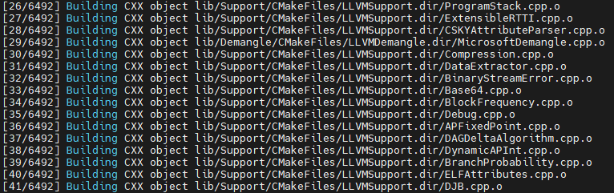
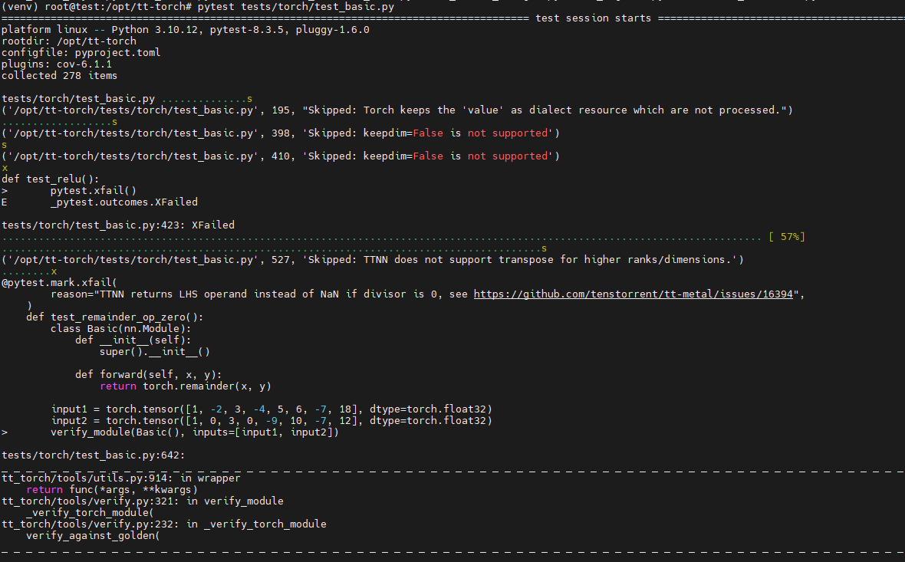

import Tabs from '@theme/Tabs';
import TabItem from '@theme/TabItem';
import { useState } from 'react';

# Tenstorrent SDK Installation TT-Torch

<br />

This Tenstorrent TT-Torch Installation Guide will walk you through the setup process for TT-Torch, Tenstorrent's PyTorch-based front-end for tt-mlir. TT-Torch enables you to compile PyTorch models to run efficiently on Tenstorrent NPU hardware.

This guide focuses on installing TT-Torch and setting up its core components. We will cover the installation process step by step, ensuring you can successfully build and run TT-Torch on your system.

:::info Important
Before proceeding with this installation, make sure you have already set up the basic hardware environment and drivers for your Tenstorrent NPU. If you haven't done this yet, please check the [hardware setup instructions](/docs/gettingstarted/installation_guide) first.
:::

<br />

# 1. Prerequisites

TT-Torch requires several dependencies to be installed on your system. The main project dependencies are:

- clang (version 17 recommended, but 14+ works)
- Ninja build system
- CMake (version 3.30 or higher)
- Python 3.10
- GCC 11 toolchain

Let's install these dependencies one by one.

First, update your package lists and upgrade existing packages:

```bash title="bash"
# Update package list
sudo apt update -y
sudo apt upgrade -y
```

<br />

## 1.1 Install Dependencies Package 

On Ubuntu 22.04 systems these can be installed using the following commands:

```bash title="bash"
# Install GCC 11 Toolchain
sudo apt install -y gcc-11 lib32stdc++-11-dev lib32gcc-11-dev

# Install Clang
sudo apt install -y clang-17

# Install Ninja Build System
sudo apt install -y ninja-build

# tt-torch requires the python 3.10 dev package, as well as the venv package.
sudo apt install -y  python3.10-venv python3.10-dev

# Remove any existing CMake installation and install the latest version using pip
sudo apt remove -y cmake
pip3 install cmake --upgrade

# Add CMake to your PATH by adding the following line to your `.bashrc` file:
echo 'export PATH=$PATH:$HOME/.local/bin' >> ~/.bashrc
source ~/.bashrc
```

---

# 2. Building TT-Torch

Now that all dependencies are installed, let's proceed with building TT-Torch.

## 2.1 Clone the Repository

First, clone the TT-Torch repository:

```bash title="bash"
git clone https://github.com/tenstorrent/tt-torch.git
cd tt-torch
```

<br />

## 2.2 Set Up the Toolchain

TT-Torch requires a toolchain build. By default, the toolchain is built in `/opt/ttmlir-toolchain`. This path is controlled by the `TTMLIR_TOOLCHAIN_DIR` environment variable.

```bash title="bash"
# Create toolchain directory
sudo mkdir -p /opt/ttmlir-toolchain
sudo chown -R $USER /opt/ttmlir-toolchain

# Build environment
cd third_party
export TTMLIR_TOOLCHAIN_DIR=/opt/ttmlir-toolchain/
cmake -B toolchain -DBUILD_TOOLCHAIN=ON
cd -
```

:::note
The compilation process may take some time depending on your system's performance. ( 10min ~ 20min)
:::

<br />

## 2.3 Compile TT-Torch

Run the following commands to compile TT-Torch:

```bash title="bash"
source env/activate
cmake -G Ninja -B build
cmake --build build
cmake --install build
```

<br />

## 2.4 Verify Installation

Run a basic test to verify that TT-Torch is working correctly:

```bash title="bash"
pytest tests/torch/test_basic.py
```



:::note
This file verifies the correctness of basic PyTorch operations when executed using the `tt-torch` runtime on Tenstorrent NPUs.  
It includes unit tests for operators such as `add`, `abs`, `clamp`, `concat`, `linear`, and more. These tests ensure that TT-Torch can compile and execute PyTorch-based modules with accurate outputs.
:::

<br />

### Re-entering the TT-Torch Environment

After installation, you don't need to repeat the setup process every time.  
To start using TT-Torch again, simply activate the previously set up environment:

```bash title="bash"
cd /path/to/tt-torch
source env/activate
```


