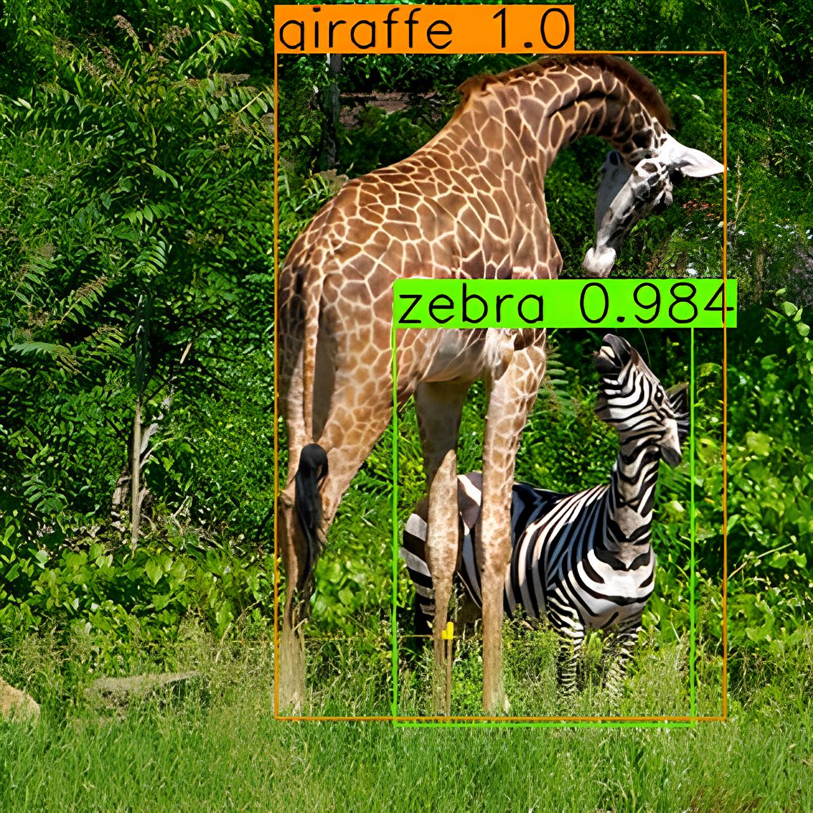
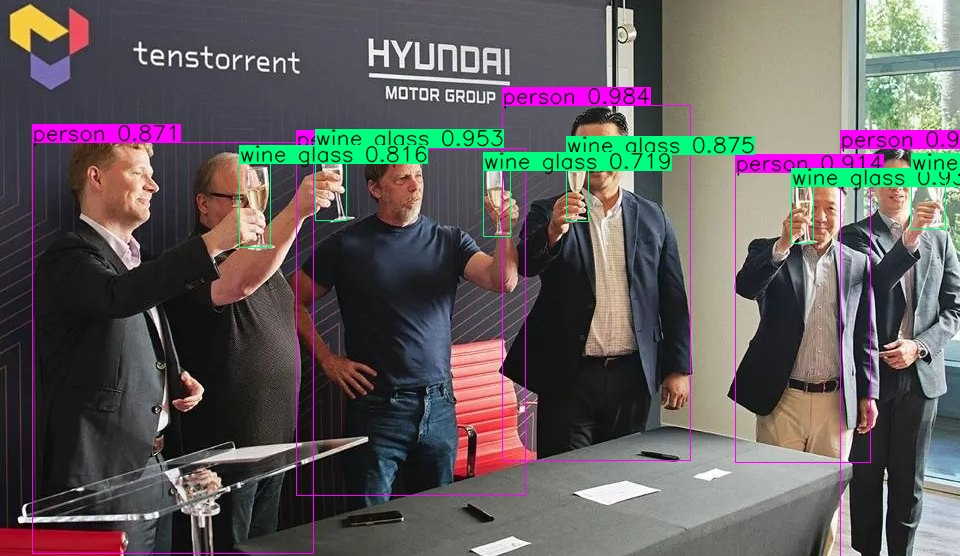

import Tabs from '@theme/Tabs';
import TabItem from '@theme/TabItem';
import { useState } from 'react';

# Run Your First Model with TT-Metal

This guide will walk you through running your first AI model using TT-Metal on Tenstorrent NPU hardware. We'll use the YOLOv4 object detection model as an example to demonstrate how to run models with TT-Metal.

:::info Important
Before proceeding, make sure you have already installed TT-Metal and set up your Tenstorrent NPU environment. If you haven't done this yet, please follow the [TT-Metal Installation Guide](/docs/tenstorrent-sdks/tt-metal/tt-metal-installation) first.
:::

<br />

# 1. Understanding the Example

We'll use the **YOLOv4** model from the TT-Metal demos. YOLOv4 (You Only Look Once) is a state-of-the-art object detection model that can identify multiple objects in an image with bounding boxes. The example will:

- **Run a pre-trained YOLOv4 model on Tenstorrent hardware**
- **Process a sample image containing animals (giraffe and zebra)**
- **Detect and classify objects in the image**
- **Generate a visualization with bounding boxes and confidence scores**

<br />

# 2. Setting Up the Environment

First, make sure you're in the TT-Metal repository directory:

```bash title="bash"
cd /path/to/tt-metal
```

<br />

# 3. Running the YOLOv4 Demo

TT-Metal includes a YOLOv4 demo that can detect objects in images. The demo uses a pre-trained model and runs inference on a sample image.

## 3.1 Run the Demo with Default Settings

To run the YOLOv4 demo with the default image at 320x320 resolution:

```bash title="bash"
pytest models/demos/yolov4/demo.py::test_yolov4[device_params0-resolution0]
```

This command will:
1. Load the pre-trained YOLOv4 model
2. Run inference on a default image containing a giraffe and zebra
3. Process the detection results
4. Generate a visualization with bounding boxes

<br />

## 3.2 Understanding the Output

During execution, you'll see output similar to this:

```bash title="output"
-----------------------------------
       max and argmax : 0.001341
                  nms : 0.000806
Post processing total : 0.002147
-----------------------------------
## (zebra: 98.4%, giraffe: 100%)
zebra: 0.984375
giraffe: 1.000000
save plot results to ttnn_yolov4_prediction_demo.jpg
```

<br />

## 3.3 View the Results

The demo saves the visualization to a file named `ttnn_yolov4_prediction_demo.jpg` in your current directory. This image shows the detected objects with bounding boxes and confidence scores.



<br />

### You can also run the YOLOv4 demo with your own images:

```bash title="bash"
pytest --disable-warnings --input-path=/path/to/your/image.jpg models/demos/yolov4/demo.py
```

