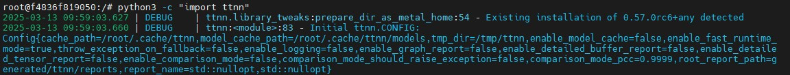
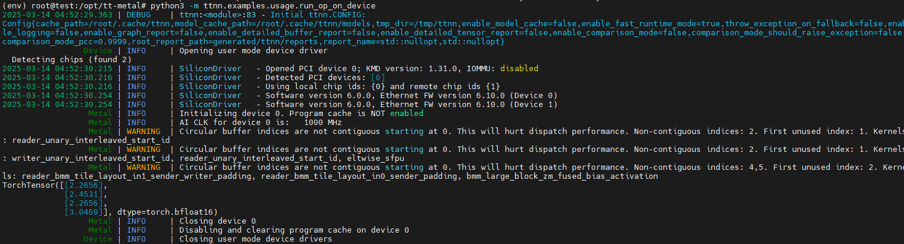

import Tabs from '@theme/Tabs';
import TabItem from '@theme/TabItem';
import { useState } from 'react';


# Tenstorrent SDK Installation TT-Metal


<br />

In the previous guide, we introduced the installation of drivers and the basic environment setup required for Tenstorrent NPU.

This Tenstorrent TT-Metal Installation Guide will walk you through the setup process for TT-Metal, Tenstorrent’s low-level SDK that provides direct control over NPU hardware. 

This guide focuses on installing TT-Metal and setting up its core components. While TT-Metalium enables more advanced kernel development, we will mainly cover the setup process without going into deep customization.


- TT-NN: A library of optimized neural network operators with a PyTorch-like API.
- TT-Metalium: A low-level programming model for building and customizing kernels.

:::info Important
If you are using a release version of this software, check installation instructions packaged with it. You can find them in either the release assets for that version, or in the source files for that [version tag.](https://github.com/tenstorrent/tt-metal/tags)
:::


<br />

# 1. Setup The Hardware
If you have not set up the basic hardware environment yet, please check the setup instructions [here](/docs/gettingstarted/installation_guide) before proceeding.

<br />

# 2. TT-NN / TT-Metalium Installation       

There are three ways to install TT-Metalium , TT-NN depending on your development needs:

## 2.1 Installing from Source
This option provides the most control, allowing developers to work directly with the source code and optimize for specific hardware configurations.


### Step 1: Clone the Repository
First, clone the TT-Metal repository along with its submodules:

```bash title="bash"
## This ensures that all necessary dependencies are included in the codebase.
git clone https://github.com/tenstorrent/tt-metal.git --recurse-submodules
```

<br />

### Step 2: Install Dependencies
Before building TT-Metal, install the required dependencies:

```bash title="bash"
## This script ensures that all necessary packages are installed before proceeding.
./install_dependencies.sh
```

<br />

### Step 3: Build TT-Metal and Set Up Virtual Environment
After installing dependencies, build TT-Metal and set up a virtual environment by running:

```bash title="bash"
## This script ensures that all necessary packages are installed before proceeding.
## This will compile TT-Metal and activate a dedicated Python environment for execution.
./build_metal.sh && ./create_venv.sh
source python_env/bin/activate
```

---

## 2.2 Installing from a Docker Release Image
The fastest way to get started. This method provides a pre-configured environment to quickly access our APIs and run AI models without additional setup.

### Step 1: Download the Latest Docker Image
First, pull the latest TT-Metal Docker image from the official registry:

```bash title="bash"
## This will download the latest release of the TT-Metal Docker container.
docker pull ghcr.io/tenstorrent/tt-metal/tt-metalium-ubuntu-20.04-amd64-release:latest-rc
```

<br />

### Step 2: Run the Docker Container
After downloading the image, start the container using the following command:

```bash title="bash"
## This script ensures that all necessary packages are installed before proceeding.
docker run -it --rm -v /dev/hugepages-1G:/dev/hugepages-1G --device /dev/tenstorrent ghcr.io/tenstorrent/tt-metal/tt-metalium-ubuntu-20.04-amd64-release:latest-rc bash
```

<br />

### Step 3:  Verify Installation
Once inside the container, run the following command to check if the TT-Metal package is installed correctly:



---

## 2.3 Installing from a Wheel Package
If you want quick access to TT-Metal APIs without building from source or using Docker, installing via a pre-built wheel package is the fastest method. This approach is ideal for getting an AI model up and running with minimal setup.

### Step 1: Download and Install the Latest Wheel Package
To install TT-Metal, you first need to download the correct wheel file based on your Ubuntu version and Python version. You can find the latest release [here](https://github.com/tenstorrent/tt-metal/releases).

General Installation Command

```bash title="bash"
pip install <wheel_file.whl>
```

If you’re using Ubuntu 22.04 with Python 3.10, use the following commands:

```bash title="bash"
# Recommended version for Ubuntu 22.04 with Python 3.10
wget https://github.com/tenstorrent/tt-metal/releases/download/v0.57.0-rc5/ttnn-0.57.0rc5+any-cp310-cp310-linux_x86_64.whl
pip install ttnn-0.57.0rc5+any-cp310-cp310-linux_x86_64.whl
```

If you’re using Ubuntu 20.04 with Python 3.8, use this instead:

```bash title="bash"
# Recommended version for Ubuntu 20.04 with Python 3.8
wget https://github.com/tenstorrent/tt-metal/releases/download/v0.57.0-rc5/ttnn-0.57.0rc5+any-cp38-cp38-linux_x86_64.whl
pip install ttnn-0.57.0rc5+any-cp38-cp38-linux_x86_64.whl
```

<br />

# 3. Verifying the Installation
If you’re planning to use TT-Metal for running AI models, there are a few additional steps to make sure everything runs smoothly.

 - Install extra dependencies
 - Set up environment variables

 Before proceeding, make sure you’ve completed [Step 1: Clone the Repository](#step-1-clone-the-repository).

<br />

## 3.1 Configure the Environment for AI Models
After installing the TT-Metal wheel package, additional configurations are required to ensure AI models run efficiently. These steps will help optimize performance and ensure the environment is set up correctly.

Set Up the Python Path in the TT-Metal Home Directory

To allow TT-Metal to correctly locate all necessary files, you must run the following command inside the TT-Metal installation directory. For example, if TT-Metal is installed in `/opt/tt-metal`, first navigate there:

```bash title="bash"
cd /opt/tt-metal
export PYTHONPATH=$(pwd)
export TT_METAL_HOME=$(pwd)
```

#### Set Environment Variables

Select your Tenstorrent card model

| Card Model                   | Command |
|--------------------------|--------|
| Grayskull | export ARCH_NAME=grayskull      |
| Wormhole | export ARCH_NAME=wormhole_b0      |
| Blackhole | export ARCH_NAME=blackhole      |

<br />

```bash title="bash"
export ARCH_NAME=wormhole_b0
```

Install Required Libraries for Models

```bash title="bash"
pip install -r tt_metal/python_env/requirements-dev.txt
```

## TT-Metal is Now Fully Configured
Now that TT-Metal is installed, let’s verify the installation and ensure everything is working correctly.

## Run a Simple Operation on Your TT-Metal Device
```bash title="bash"
python3 -m ttnn.examples.usage.run_op_on_device
```

