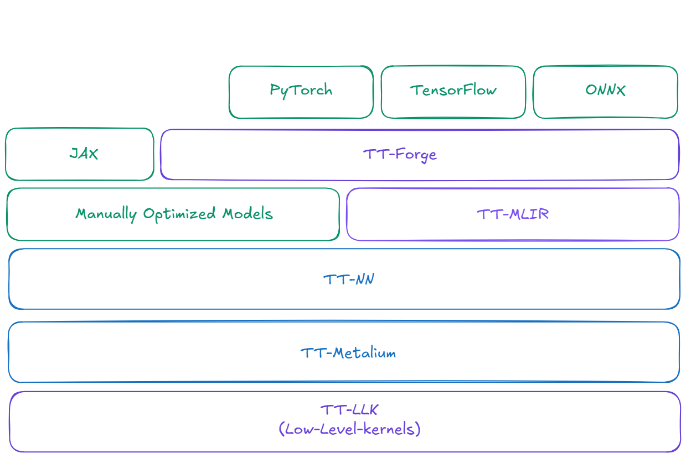

TT-Metal is a low-level Software Development Kit (SDK) for Tenstorrent Neural Processing Units (NPUs), providing direct access to the underlying hardware. It consists of two core layers—TT-NN and TT-Metalium—and enables developers to fully harness the performance of Tenstorrent chips. As the foundation of the entire software stack, all higher-level compilers and runtimes—including [TT-Forge](http://175.124.38.106:3000/docs/tenstorrent-sdks/tt-forge/tt-forge-overview) and TT-NN—ultimately operate through TT-Metal.

 - [**TT-NN**](https://github.com/tenstorrent/tt-metal) : An optimized neural network operator library with a PyTorch-like API
 - [**TT-Metalium**](https://github.com/tenstorrent/tt-metal) : A low-level programming model for developing and optimizing custom kernels

:::note
TT-Metal is designed for developers who want to work at the closest level to the hardware.
:::

 

## Key Features
TT-Metal offers various development options at different levels:

### Performance Optimization
- Support for various AI models
- Optimized operation libraries
- Data format and memory management options

### Advanced Development
- Custom kernel development
- Hardware-level optimization
- C++ programming support

 

## Relationship Between TT-Metal and TT-Forge
TT-Metal sits at the lower level of the Tenstorrent software stack, while TT-Forge is at the higher level:
- **TT-Forge**: A compiler that transforms models from frameworks like PyTorch, TensorFlow, JAX, and ONNX to run on Tenstorrent hardware.
- **TT-Metal**: A low-level SDK that provides direct hardware access for maximum performance.

 

## When to Use TT-Metal
TT-Metal is recommended in the following scenarios:
 - When you need maximum performance at the hardware level
 - When developing custom AI models or operations
 - When optimizing for specific AI workloads

 

## Getting Started
To get started with TT-Metal:
 - Step 1. [Install the required drivers and firmware](/docs/gettingstarted/installation_guide)
 - Step 2. [Set up the TT-Metal environment](/docs/tenstorrent-sdks/tt-metal/tt-metal-installation)
 - Step 3. [Run basic examples](/docs/tenstorrent-sdks/tt-metal/run-your-first-model)